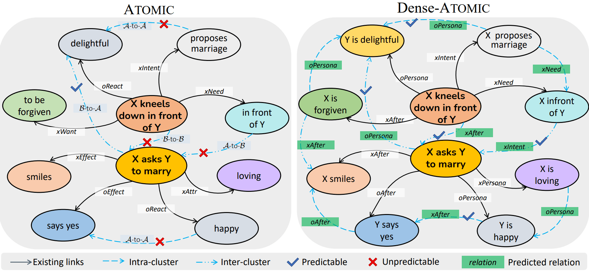

# Dense-ATOMIC: Towards Densely-connected ATOMIC with High Knowledge Coverage and Massive Multi-hop Paths



Resources and Codes for [Dense-ATOMIC: Towards Densely-connected ATOMIC with High Knowledge Coverage and Massive Multi-hop Paths](https://aclanthology.org/2023.acl-long.742.pdf)

## Bibtex

```
@inproceedings{DBLP:conf/acl/ShenWX23,
  author       = {Xiangqing Shen and
                  Siwei Wu and
                  Rui Xia},
  editor       = {Anna Rogers and
                  Jordan L. Boyd{-}Graber and
                  Naoaki Okazaki},
  title        = {Dense-ATOMIC: Towards Densely-connected {ATOMIC} with High Knowledge
                  Coverage and Massive Multi-hop Paths},
  booktitle    = {Proceedings of the 61st Annual Meeting of the Association for Computational
                  Linguistics (Volume 1: Long Papers), {ACL} 2023, Toronto, Canada,
                  July 9-14, 2023},
  pages        = {13292--13305},
  publisher    = {Association for Computational Linguistics},
  year         = {2023},
  url          = {https://aclanthology.org/2023.acl-long.742},
  timestamp    = {Thu, 13 Jul 2023 16:47:40 +0200},
  biburl       = {https://dblp.org/rec/conf/acl/ShenWX23.bib},
  bibsource    = {dblp computer science bibliography, https://dblp.org}
}
```

<h1> Dense-ATOMIC </h1>

We currently release two versions of Dense-ATOMIC. More work is in progress.

Dense-ATOMIC-base:

[baidu disk](https://pan.baidu.com/s/1zQsX26MHTp3Hcxac5czsJw?pwd=nkbo  ), [google drive](https://drive.google.com/file/d/1yET0FAEej6LQtwBVVYR8nEgvFKn3xWUv/view?usp=drive_link )

| total number | 1153755 |
| ------------ | ------- |
| xNeed        | 157721  |
| xIntent      | 201780  |
| oAfter       | 224476  |
| xAfter       | 322034  |
| oPersona     | 91413   |
| xPersona     | 156331  |

Dense-ATOMIC-large:

[baidu disk](https://pan.baidu.com/s/1G3Lngc-J526Bishl5a-WYA?pwd=ld8x ), [google drive]()

| total number | 10281235 |
| ------------ | -------- |
| xNeed        | 637624   |
| xIntent      | 1104854  |
| oAfter       | 1607797  |
| xAfter       | 1964070  |
| oPersona     | 2055146  |
| xPersona     | 2911744  |

<h1>RelKGC</h1>

Codes are under review, and we will release them as soon as possible.